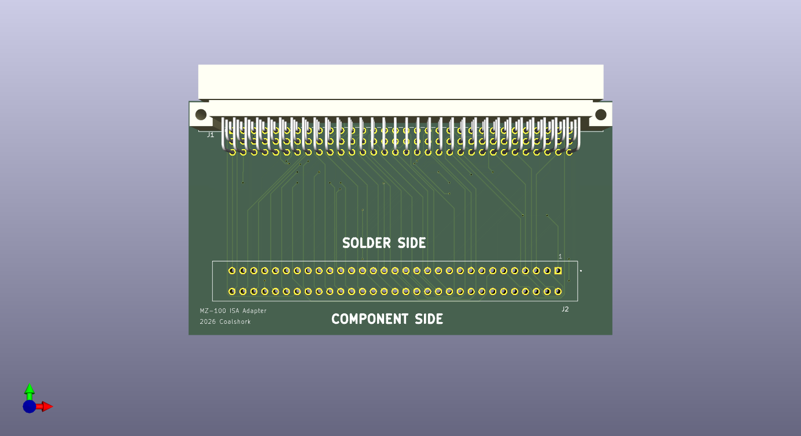
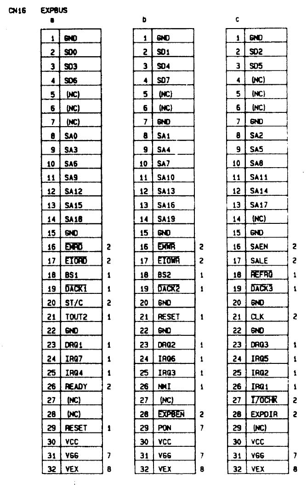
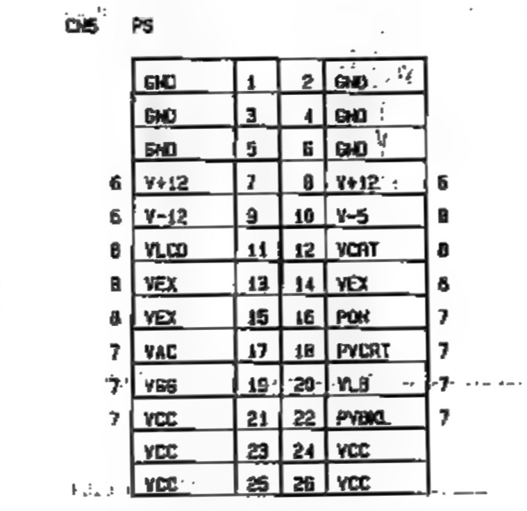

# MZ-ISA
An ISA adapter for the Sharp MZ-100 and Sharp 4602/4641 laptop

This is just a quick and dirty passive adapter allowing MZ-100 owners to connect things like sound, video, and serial cards to their MZ-100. 

# Background
I picked up my MZ at a thrift store in Mankato, MN, and after getting it home and testing it I realized how neat it was. Seriously, a setup key to change settings on the fly? Why didn't more computers have that? I quickly fell in love with the machine, and naturally I wanted to know more about it, which is when I realized the severe lack of documentation and unanswered forum questions. Luckily, My MZ happened to come with the user manual, software, and a boot disk! After some thorough digging, it dawned on me that "MZ-100" is the *American* release name for this laptop, and in Japan it was known as the Sharp 4602. Searching for that finally yielded a service manual, which sharp thoughfully filled with pin definitions for all the connectors. As it turns out, the unpopulated 96 pin header on the rear of the machine contains all the necessary signals for an 8 bit ISA connection, leading me to create this converter. I hope to make more peripherals for this neat little system as it seems to have lots of expandability. The user manual goes over the expansion boards it had including a modem, video card, external FDD, and even a RAM disk to make up for the lack of hard disk. If I get my hands on any of these, I'll be sure to document them thoroughly.

# Instructions
### Parts required:
Board, 8 bit ISA connector, 96 Pos DIN 41612 connector (BOTH male and female)

### Prepping the MZ-100
Unfortunately, on my MZ, Sharp didn't feel the need to supply an expansion connector from the factory. This means I (and probably most out there) will need to solder their own connector onto the header (CN16) to use it. Another thing Sharp didn't feel the need for are the +12, -5, and -12 voltage rails. You'll need to find a supply of those, like the bottom of the PSU connector for example, and use a bodge wire to connect it to the expansion header. Thankfully, Sharp included many no connection pins on the header. I have -5v connected to pin a5, +12 to a6, and -12 to a7.

On the power supply header, pin 7 is +12, 9 is -12, and 10 is -5. See the included table and images for reference.

### Assembling the board
The assembly is straightforward, just make sure you take care to not damage any of the vias that are near the pins on the expansion connector.

# Compatibility
At the time of writing this (the night the board was finished) I don't yet have a board. I'll update this section once I get mine and test it. Expect more revisions to come in the future.
If you make this adapter and use it, PLEASE let me know! My contact information is in my github bio or at https://coalshark.carrd.co/

